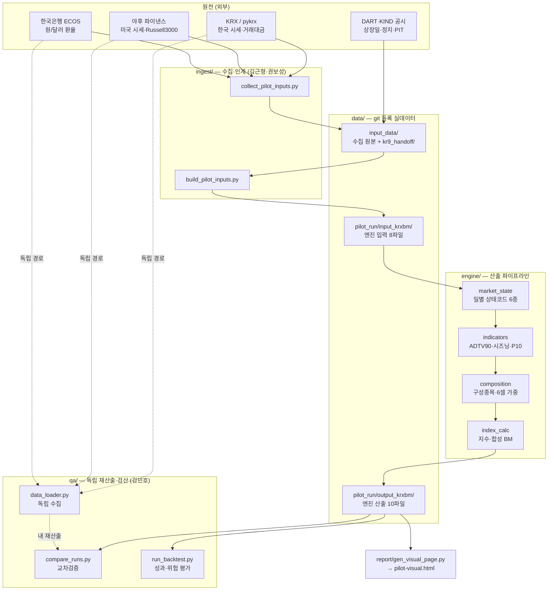

# 데이터 플로우 — 원자료에서 지수까지

이 문서는 **실제로 저장소에 들어 있는 파일과 코드를 그대로 따라간 것**이다. 계획이 아니라 현황이다.
숫자·행수·경로는 `v0.9-pilot` 본실행 산출물(`06_코드/data/pilot_run/`)에서 직접 읽었다.

- 기준 문서(단일 원본): [결정로그](/01_운영문서/결정로그.md) · [데이터 사전](/01_운영문서/데이터사전.md) · [룰북 v0.4](/01_운영문서/260724_커스텀인덱스_구성및산출_룰북_v0.4_결정반영본.md)
- 코드 구조: [06_코드/README.md](/06_코드/README.md) · 작성 규칙: [AGENTS.md](/AGENTS.md)
- 마지막 확인: 2026-07-27 (팀 리팩터 `7b084ae` 반영본)

---

## 1. 한눈에



> mermaid가 렌더되지 않는 뷰어라면 아래 2~5장의 표만 읽어도 같은 내용이다.

---

## 2. 단계별 흐름

| # | 단계 | 하는 일 | 코드 | 결과물 |
|---|---|---|---|---|
| 1 | 수집 | 외부 원천에서 시세·환율·BM·상장일을 받아온다 | `ingest/collect_pilot_inputs.py` | `data/input_data/*.csv` |
| 2 | 인계 | 한국 9종목분(공시근거·정지·PIT)을 별도 인계받는다 | 수기 (김근형) | `data/input_data/kr9_handoff/` |
| 3 | 병합 | 한·미를 엔진 입력계약 8파일로 합친다 | `ingest/build_pilot_inputs.py` | `data/pilot_run/input_krxbm/` |
| 4 | 상태판정 | 종목×일자마다 상태코드 6종을 부여한다 | `engine/market_state.py` | `daily_market_state.csv` |
| 5 | 지표 | 90개장일 창으로 ADTV90·시즈닝을 계산하고 시장별 P10 하한을 뽑는다 | `engine/indicators.py` | `adtv90_ledger.csv`, `thresholds_*.json` |
| 6 | 구성 | 적격 종목을 고르고 6셀(3테마×2시장)에 각 1/6, 셀 내 동일가중 | `engine/composition.py` | `constituents_*.csv`, `weights_*.csv`, `cell_shortage.csv` |
| 7 | 산출 | 포트폴리오 지수와 합성 BM을 기준값 1,000에서 산출 | `engine/index_calc.py` | `index_vs_benchmark.csv` |
| 8 | 발표 | 산출물을 위키용 단독 HTML로 렌더 | `report/gen_visual_page.py` | `pilot-visual.html` |
| 9 | 검증 | 독립 수집·교차검증·성과 평가 | `qa/*.py` | `qa/figures/*.png` (git 미추적) |

4~7단계는 `engine/run_pilot.py` 한 번의 실행에서 순서대로 일어난다.

---

## 3. 엔진 입력 — 8파일 계약

스키마 원본은 `engine/run_pilot.py` 상단 주석(입력계약, D-13 ④ 승인). 행수는 `data/pilot_run/input_krxbm/` 실측치다.

| 파일 | 컬럼 | 실측 | 출처 |
|---|---|---|---|
| `seed_basket.csv` | security_id, entity_id, market, primary_theme, gate_status | 18행 | KR 9 + US 9, 3테마×2시장 각 3종목 |
| `prices.csv` | security_id, market, market_date, raw_close, volume, exchange_trading_value | 23,188행 (2013-01-02 ~ 2026-07-23) | KR=KRX 거래대금 포함, US=야후 |
| `calendar.csv` | market, market_date, is_market_open | KR 개장 180일 · US 187일 · **공통 175일** | BM 시계열에서 유도 |
| `listings.csv` | security_id, listing_date, delisting_date | 18행 | 실상장일 (SPCX만 REVIEW_REQUIRED) |
| `halts.csv` | security_id, market_date, full_day_halt | 21행 | KRX·KIND |
| `fx.csv` | market_date, fx_rate | 181행 | 한국은행 ECOS (계열 731Y001 잠정) |
| `bm_kr.csv` | market_date, close | 180행 | KOSPI 200 PR — KRX 공식값 |
| `bm_us.csv` | market_date, close | 187행 | Russell 3000 PR (^RUA), USD |

각 파일의 생성 주체·상태는 [INPUT_MANIFEST.md](/06_코드/data/input_data/INPUT_MANIFEST.md)에 따로 기록돼 있다.

---

## 4. 엔진이 적용하는 규칙

전부 `engine/config.py`에만 정의된다(룰북 R1 — 다른 모듈에 리터럴 숫자 금지). 현재 동결값(D-13 ①, `rule_version=v0.9-pilot`):

| 항목 | 값 | 비고 |
|---|---|---|
| 선정일 | 2026-03-31, 2026-06-30 | 2회차 |
| 자료마감 | 선정일 − 5거래일 | 공통 거래일 축으로 역산 (D-13 ⑧) |
| 효력발생 | 선정일 이후 첫 공통 개장일 | |
| ADTV90 관측창 | 90개장일 | 시장별 개장일 축 |
| ADTV90 정지일 처리 | 0으로 반영 (`ZERO`) | 분모 제외값은 진단으로 병기 |
| 유동성 하한 | 시장별 분포 P10 **잠정** | 절대금액 승인은 분포표 후 의결 |
| 시즈닝 최소 관측 | 90일 | |
| 구성 방식 | 적격 전부 편입, 상한 없음 | 대안 A |
| 가중 | 6셀 각 1/6, 셀 내 동일가중 | `WEIGHTING_STATUS=TEMPORARY` |
| 산출 | PR · 원화 · 무헤지 · 기준값 1,000 | BM = KR 0.5 + US 0.5 합성 |

상태코드 6종: `TRADED` / `ZERO_VOLUME` / `TRADING_HALT` / `DATA_MISSING` / `NOT_LISTED` / `MARKET_CLOSED`.
`DATA_MISSING`은 0으로 채우지 않고 분모에서 제외하며, `ZERO_VOLUME`·`TRADING_HALT`는 거래대금 0으로 반영한다(룰북 R6 — 이 둘을 섞지 않는다).

본실행 실측 분포: `TRADED` 3,125 · `NOT_LISTED` 175 · `TRADING_HALT` 3 (`ZERO_VOLUME`·`DATA_MISSING` 0건).
거래대금 경로는 `EXCHANGE_PROVIDED` 1,620행(한국, KRX 제공) · `RECONSTRUCTED` 1,683행(미국, 원종가×원거래량) — 제59조 복원(D-13 ②)대로 갈렸다.

---

## 5. 엔진 산출 — 10파일

`data/pilot_run/output_krxbm/` 실측.

| 파일 | 내용 | 실측 |
|---|---|---|
| `daily_market_state.csv` | 종목×일자 상태코드·거래대금·`trading_value_source`·오차비율 | 3,303행 |
| `adtv90_ledger.csv` | 회차별 ADTV90 계산 원장(관측일수·정지일·결측일·시즈닝) | 2회차 |
| `thresholds_2026-03-31.json` | 잠정 P10 하한 — KR 739.1억 / US 3.09억USD | |
| `thresholds_2026-06-30.json` | 잠정 P10 하한 — KR 1,268.8억 / US 3.25억USD | |
| `constituents_<선정일>.csv` | 선정 결과 + 제외사유 + 판정근거 27개 필드 | 각 18행 |
| `weights_<선정일>.csv` | 종목별 최종 목표비중 (셀 1/6 → 셀 내 균등) | 각 18행 |
| `cell_shortage.csv` | 셀별 잔존수 부족 플래그 | 12행, **전 셀 부족 없음(0)** |
| `index_vs_benchmark.csv` | 일별 지수·BM·alpha·rule_version | 59행 (2026-04-01 ~ 2026-06-30) |

파일럿 본실행 결과(누적, 2026-04-01→06-30): **지수 +27.11% / 합성 BM +41.78%** — BM 하회.
`data/pilot_run/output/`(예비 BM 세트)의 `index_vs_benchmark.csv`는 현재 `output_krxbm/`과 **동일하다**(확인함).

> 인용 시 `rule_version=v0.9-pilot` 병기. 가중은 `TEMPORARY`, 하한은 P10 잠정이므로 확정 성과가 아니다.

---

## 6. 검증 — qa 트랙이 어디에 붙는가

`qa/`는 **engine을 import하지 않는다.** 규칙 문서만 근거로 별도 구현하고, 비교 대상은 engine이 이미 낸 산출물이다.

| 도구 | 무엇을 보는가 | 기본 입력 |
|---|---|---|
| `qa/data_report.py` | 엔진 투입 전 입력 검수 — 종목별 관측일수·환율·BM | `data/pilot_run/input_krxbm/` |
| `qa/data_loader.py` | 팀과 **독립 경로**로 같은 유니버스를 재수집 | 외부 원천 → `qa/collected/` |
| `qa/compare_runs.py` | 두 산출의 지수 시계열 대조 — 상관·최대괴리 | 기준 `output_krxbm/` vs 내 재산출 |
| `qa/run_backtest.py` | 성과·위험 평가 (CAGR·변동성·Sharpe·MDD·TE·IR·턴오버) | `data/pilot_run/output_krxbm/` |

경로는 `qa/paths.py` 한 곳에만 정의한다. 폴더 구조가 또 바뀌면 그 파일만 고치면 된다.

```bash
cd 06_코드/qa
python run_backtest.py      # 실산출 평가 → figures/backtest_dashboard.png
python data_report.py       # 입력 검수  → figures/data_overview.png
python compare_runs.py      # 교차검증   → figures/compare_dashboard.png (내 재산출 선행 필요)
```

`qa/figures/`·`qa/collected/`는 git 미추적이다. 재현하면 같은 결과가 나오므로 저장소에 넣지 않는다.

---

## 7. 지금 시점의 한계 (확정 아님)

산출물을 읽을 때 반드시 함께 보는 항목이다. 감추지 않고 여기 적는다.

1. **수정주가 미반영** — `prices.csv`에 `adj_close` 컬럼이 없어 엔진이 `raw_close`로 지수를 평가했다. D-07은 지수 평가를 수정주가 전용으로 정했으므로, 관측 구간에 분할이 있었던 종목은 지수가 왜곡될 수 있다. 수정주가 확보 후 재산출 필요.
   덧붙여 `index_calc.py`는 이때 `valuation_price_source`를 세팅하고 콘솔 경고만 남기며, **어떤 산출 파일에도 기록하지 않는다** — 산출물만 받아본 사람은 폴백 사실을 알 수 없다. 기록 위치 지정이 필요하다(미결 등록 대상).
2. **adj_close 정의가 확정 대기** — 데이터사전 4.1(2026-07-24): 분할 등 주식수 변동만 조정, 배당 미조정(PR 정합). 야후 `Adj Close`는 배당까지 조정된 TR 성향이라 직접 사용 금지 — 분할계수만 재구성해야 한다.
3. **유동성 하한이 P10 잠정** — 절대금액 승인은 ADTV90 분포표를 본 뒤 별도 의결(D-13 ⑤). 지금 값으로 종목이 걸러진 것이 최종 판정은 아니다.
4. **가중이 TEMPORARY** — 6셀 1/6 균등은 잠정이며 안건 H에서 확정한다.
5. **관측 구간이 59거래일** — 2회 리밸런스뿐이라 성과 지표의 통계적 의미는 제한적이다. CAGR 연율화 수치는 특히 과대 해석 금지.
6. **일부 참조자료가 예비 경로** — SPCX 상장일은 EDGAR 원출처 확인 대기(REVIEW_REQUIRED), fx 계열코드는 잠정.

성과를 본 뒤 `config.py`나 규칙을 되돌아가 고치지 않는다(룰북 R3). 발견된 문제는 결정로그에 미결로 등록만 한다.
