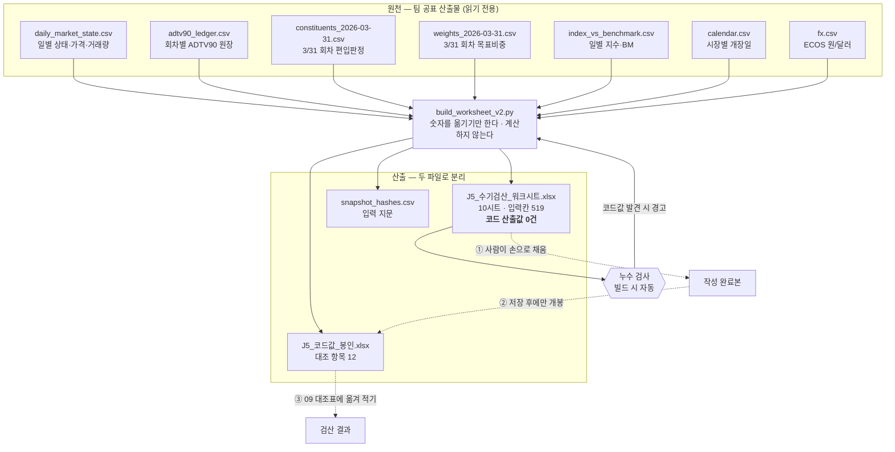

# J-5 수기 검산 워크북 — 데이터 흐름

작성 김민호(QA) · 2026-07-28 · 생성기 [build_worksheet_v2.py](build_worksheet_v2.py)

---

## 0. 이 문서가 필요한 이유

수기 검산은 **워크시트에 적힌 원자료가 정확하다는 전제** 위에서만 성립한다.
생성기가 숫자를 잘못 옮겼다면, 사람이 아무리 정확히 계산해도 결과는 틀린다.
그리고 그 오류는 코드값과 대조할 때 "수기가 틀렸다"로 잘못 결론난다.

그래서 워크북 자체도 검증 대상이다. 이 문서는 **각 칸의 숫자가 어느 파일 어느 열에서 왔는지**를
빠짐없이 적어, 제3자가 원본과 직접 대조할 수 있게 한다.

동시에 **답이 새지 않았다는 것**도 여기서 확인한다. 블라인드가 깨지면 검산 전체가 무의미해진다.

---

## 1. 전체 흐름



핵심은 **생성기가 계산을 하지 않는다**는 것이다. 원자료를 옮겨 적고 나머지는 비운다.
생성기가 계산하면 그것은 세 번째 코드 구현이지 수기 검산이 아니다.

---

## 2. 원천 파일

전부 `06_코드/data/pilot_run/` 아래 팀 공표 산출물이며 워크북 생성 과정에서 **수정하지 않는다.**

| 파일 | 위치 | 워크북에서 쓰이는 곳 |
|---|---|---|
| `daily_market_state.csv` | `output_f1/` | 03-04 · 07 · 08 |
| `adtv90_ledger.csv` | `output_f1/` | 05 · 봉인 |
| `constituents_2026-03-31.csv` | `output_f1/` | 06 |
| `weights_2026-03-31.csv` | `output_f1/` | 07(종목 목록만) · 봉인 |
| `index_vs_benchmark.csv` | `output_f1/` | 봉인 전용 |
| `calendar.csv` | `input_krxbm/` | 02 |
| `fx.csv` | `input_krxbm/` | 07 |

`output_f1`은 F-1(관측 종료일 = 자료마감일) 수정이 반영된 판이다.
각 파일의 SHA-256 앞 16자리와 행 수는 워크북 **00 시작하기** 시트와
[snapshot_hashes.csv](snapshot_hashes.csv)에 기록된다. 나중에 산출물이 바뀌면 지문이 달라지므로,
이 검산 결과가 어느 버전에 대한 것인지 특정할 수 있다.

---

## 3. 시트별 데이터 매핑

### 00 시작하기 · 01 검산지도

계산 데이터 없음. 설명·규칙·근거조항·색범례와 입력 지문 표뿐이다.
입력칸 7개는 작성자·일시 기록용이다.

### 02 자료마감일

| 열 | 내용 | 출처 |
|---|---|---|
| B 날짜 | 2026-06-15 ~ 06-30 | `calendar.csv` · KR·US 개장일의 **합집합** |
| C 한국 개장 | `O` / `-` | `calendar.csv` (market=KR, is_market_open=1) |
| D 미국 개장 | `O` / `-` | 〃 (market=US) |
| E·F·G | — | **비움** (사람이 판정·계수) |

> 합집합으로 실은 것이 의도다. 교집합만 실으면 "공통 개장일을 고르는" 판단 자체가 사라져
> 검산할 것이 없어진다. 이 구간에는 한쪽 시장만 열린 날이 실제로 존재한다.

### 03-04 거래대금·ADTV90

| 열 | 내용 | 출처 |
|---|---|---|
| B 날짜 | 2026-02-12 ~ 06-23 (90행) | `calendar.csv` US 개장일 중 자료마감일 이하 **최근 90일** |
| C 종가 | `raw_close` | `daily_market_state.csv` (security_id=KTOS) |
| D 거래량 | `volume` | 〃 |
| F 상태코드 | `daily_market_state` | 〃 |
| E 거래대금 | — | **비움** (제59조 재구성을 사람이 수행) |
| 집계 5칸 | — | **비움** |

> `daily_trading_value`(엔진이 계산한 거래대금)는 **싣지 않는다.** 그것이 E열의 답이다.
> KTOS를 고른 이유: 미국 종목이라 거래대금이 `RECONSTRUCTED`(원종가 × 원거래량)이고,
> 동시에 6/30 회차 분포의 최솟값이라 편입 판정이 실제로 갈린다.

### 05 P10 · 편입판정

| 열 | 내용 | 출처 |
|---|---|---|
| B 종목 | US 9종목 | `adtv90_ledger.csv` (market=US, selection_date=2026-06-30) |
| C ADTV90 | `official_adtv90` — **KTOS만 비움** | 〃 |
| D 시즈닝 | `seasoning_status` | 〃 |
| E·F 판정·순번 | — | **비움** |
| 계산 8칸 | — | **비움** |

> KTOS 값만 비운 것은 그것이 03-04에서 사람이 계산한 값이기 때문이다.
> 나머지 7종목은 검산 대상이 아니라 분포를 구성하는 참조자료다.
> SPCX는 `official_adtv90`이 NA(시즈닝 미달)라 `(산출 안 됨)`으로 표기하고,
> 분포에 넣을지는 사람이 판단한다 — 룰북 §8.1이 모집단을 "시즈닝 통과"로 한정한다.

### 06 목표비중

| 열 | 내용 | 출처 |
|---|---|---|
| B 종목 · C 지역 · D 테마 · E 셀 | 3/31 회차 편입 15종목 | `constituents_2026-03-31.csv` (selected_flag=1) |
| 셀 목표비중 · 종목수 · 종목당 비중 · 종목별 비중 | — | **비움** |

> `cell_target_weight`·`final_target_weight` 두 열 모두 **싣지 않는다.** 그것이 답이다.
> 편입 여부(selected_flag)는 주어진 자료로 싣는다 — 이 시트가 검증하는 것은 편입 판정이 아니라
> 비중 산술이며, 05 시트가 다루는 6/30 회차와는 다른 회차라 답이 새지 않는다.

**회차가 다른 이유.** 05는 2026-06-30 회차 판정이고 06·07은 2026-03-31 회차다.
지수 산출구간(04-01~06-30)에 실제 적용된 것은 3/31 선정분이며, 6/30 선정분은 적용일이
구간 밖이라 지수에 반영되지 않았다. 워크시트 06 시트 상단에 이 구분을 명시했다.
(룰북 245행은 적용일 세부 규칙을 후속과제로 두고 있고, 산출물에 `effective_date` 열이 없다.)

### 07 지수레벨

| 열 | 내용 | 출처 |
|---|---|---|
| B 종목 · C 지역 | 15종목 | `weights_2026-03-31.csv` (목록만) |
| E 기준일 종가 | 2026-04-01 `raw_close` | `daily_market_state.csv` |
| F 검산일 종가 | 2026-04-07 `raw_close` | 〃 |
| 환율 2칸 | 두 날짜의 `fx_rate` | `fx.csv` |
| D 목표비중 | — | **비움** (06 시트에서 이월) |
| G~J 원화가격·가격비·기여도 | — | **비움** |

> 초판에서 D열에 `final_target_weight`를 실었다가 누수 검사에 걸렸다. 06 시트의 답이 샜기 때문이다.
> 입력칸으로 바꾸어 06 → 07로 이어지게 했다.

**검산일을 2026-04-07로 고른 이유.** 기준일(04-01)과 검산일이 모두 010120 분할 이전이라,
**분할 보정 적용 여부와 무관하게 지수값이 동일하다**(as-run·보정본 모두 1023.801567).
따라서 엔진의 공식 재산출을 기다리지 않고 지금 검산해도 재작업이 발생하지 않는다.

### 08 분할효과

| 열 | 내용 | 출처 |
|---|---|---|
| B 날짜 | 2026-04-06 ~ 04-16 | `daily_market_state.csv` (security_id=010120) |
| C 원종가 | `raw_close` | 〃 |
| D 상태코드 | `daily_market_state` | 〃 |
| E 조정 종가 · F 수익률 | — | **비움** |
| 비교 4칸 | — | **비움** |

> 분할비율 5와 경계일 2026-04-13은 **규칙으로 제시**하고 계산은 비운다.
> 근거는 DART 원공시 `20260205800493` · 정정공시 `20260205800571`이며
> 검증 기록은 [../corrected_run/EVIDENCE.md](../corrected_run/EVIDENCE.md)에 있다.

### 09 대조표 · 10 발표용요약

12개 검산 항목의 이름·시트·단위만 싣는다. 수기값·코드값·판정은 비운다.
10 시트는 09 시트를 수식으로 참조하므로 09를 채우면 자동으로 채워진다.
판정 칸에는 `일치 / 불일치 / 미확인` 드롭다운이 걸려 있다.

---

## 4. 봉인 파일의 산출 근거

`J5_코드값_봉인.xlsx`는 12개 항목의 코드값과 **그 값이 어디서 나왔는지**를 함께 싣는다.
값만 있으면 불일치 시 원인을 못 찾는다.

| 항목 | 산출 방식 |
|---|---|
| A 자료마감일 | 상수 `CUTOFF` — `adtv90_ledger.data_cutoff_date`와 동일 |
| B ADTV90 | `adtv90_ledger.official_adtv90` (KTOS, 6/30) |
| C 분모 | `observed_open_days` + `halt_days_90` · `missing_days_90` 병기 |
| D P10 | `np.percentile(정렬값, 10)` — `thresholds_2026-06-30.json`과 일치 확인됨 |
| E 편입 여부 | B와 D 비교 |
| F P10 미만 수 | 분포에서 직접 계수 |
| G 최소 n | `h=(n−1)×0.10 ≥ 1` 을 만족하는 최소 정수 |
| H 비중 합계 | 6셀 × 1/6 |
| I 최대 비중 | `weights_2026-03-31.final_target_weight.max()` |
| J 지수 레벨 | `index_vs_benchmark.index_level` (2026-04-07) |
| K·L 분할 수익률 | `raw_close` 04-13 ÷ 04-07 (조정 전 / 후) |

---

## 5. 블라인드 보장

### 무엇을 뺐는가

| 시트 | 뺀 값 | 뺀 이유 |
|---|---|---|
| 03-04 | `daily_trading_value`, `official_adtv90` | E열·집계칸의 답 |
| 05 | KTOS의 `official_adtv90`, `provisional_P10` | 05 계산칸의 답 |
| 06 | `cell_target_weight`, `final_target_weight` | 06 전체의 답 |
| 07 | `final_target_weight`, `index_level` | 06·07의 답 |
| 08 | 조정 종가·수익률 | 08의 답 |

### 자동 검사

빌드할 때마다 워크시트 전 시트의 모든 수치 셀을 훑어, 금지값과 상대오차 1e-9 이내로
일치하는 셀이 있으면 경고한다. 금지값은 KTOS ADTV90 · P10 · 지수레벨 · 1/6 · 1/18이다.

```
[검사] 코드 산출값 누수 없음 — 블라인드 성립
```

이 검사는 실제로 작동했다. 초판 빌드에서 07 시트의 `1/18` 13건이 검출돼 수정했다.

### 이 분리가 뜻하는 것

| 검증 | 독립성 등급 | 성격 |
|---|---|---|
| `qa/independent` 독립 재산출 | `SPEC_ASSISTED` | 산출물 사전 열람 있음 · 코드가 코드를 검증 |
| **J-5 수기 검산** | **블라인드** | 답을 보기 전에 결과 고정 · 사람이 코드를 검증 |

두 검증은 서로 다른 실패를 잡는다. 독립 재산출은 구현 차이를,
수기 검산은 **두 구현이 같은 오해를 공유하는 경우**를 잡는다.

---

## 6. 재현

```bash
cd 06_코드/qa/manual_check
python build_worksheet_v2.py
```

같은 입력이면 같은 워크북이 나온다. 난수·시각 의존이 없다.
빌드 후 마지막 줄에 누수 검사 결과가 출력된다.

원자료를 직접 대조하려면 00 시트의 지문과 원본 파일 해시를 비교하면 된다.

```bash
sha256sum 06_코드/data/pilot_run/output_f1/adtv90_ledger.csv
```

---

## 7. 한계 — 읽는 사람이 알아야 할 것

**1. 시트에 적힌 규칙 설명은 생성자의 룰북 해석이다.**
각 시트 상단의 "■ 규칙" 블록은 내가 룰북을 읽고 옮겨 적은 것이며, `qa/independent`의
독립 재산출도 같은 해석에서 나왔다. 내가 룰북을 잘못 읽었다면 수기 검산자가 그 오독을
그대로 물려받는다. 그래서 모든 규칙에 근거 조항을 병기했다.
**해당 조항을 직접 펴서 설명이 맞는지 대조하는 것이 이 검산에서 가장 값어치 있는 부분이다.**
어긋나면 그 자체가 발견이며, 대조표 H열에 기록한다.

**2. 검산 범위는 구현된 관문까지다.**
룰북 §9는 편입 관문에 시장·증권유형·시즈닝·유동성·**재무조건**을 둔다.
그런데 재무 지표(당좌비율 — 산출 미실행 / TTM 순이익 — 후순위)가 구현되지 않아
파일럿은 시즈닝·유동성 2개 관문만 적용했다.
따라서 검산 결론은 "코드가 룰북대로 계산했다"가 아니라
**"구현된 관문 범위 안에서 룰북대로 계산했다"**로 써야 한다.

**3. 검산 통과는 성과의 신뢰성과 무관하다.**
수기 검산이 말하는 것은 계산이 규칙대로 되었는지뿐이다.
성과의 통계적 유의성은 별개이며, 표본 58일·추적오차 32.57%에서 알파의 t값이 −0.372라
0과 구분되지 않는다. 두 이야기를 섞지 않는다.

**4. 표본은 소표본이다.**
담당표 73행이 "소표본"을 명시하고 있다. 12개 항목·1개 종목·1개 회차·1개 산출일이며
전수 검증이 아니다. 경계사례 위주로 골랐다(룰북 §18.2).

---

## 관련 문서

- [DATAFLOW.md](../../DATAFLOW.md) — 파이프라인 전체 데이터 흐름
- [EVIDENCE.md](../corrected_run/EVIDENCE.md) — 010120 분할 공시 검증 기록
- [MIGYEOL.md](../independent/MIGYEOL.md) — 독립 재산출의 미결·가정·발견
